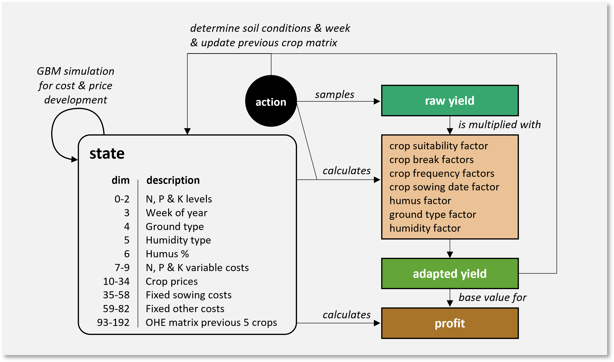
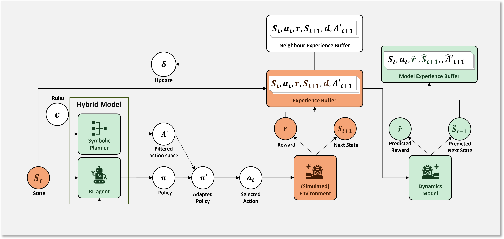

# Crop rotation optimization for organic farming systems by combining model-based reinforcement learning methods with symbolic planning

This is the official GitHub repository for the paper "Crop rotation optimization for organic farming systems by combining model-based reinforcement learning methods with symbolic planning". The paper is currently in a preprint version and not yet published. As soon as a preprint of the paper is available online, it will be linked here.

## Abstract

In modern organic farming, cultivating a sequence of varying crops on a plot of land is the standard for many farmers. This behaviour leads to better soil conditions, avoids pest and weed occurrence and increases crop yields if done correctly. Since many years, researchers have tried to convert the intuitional knowledge of farmers and the current state-of-the-art of agronomy into rule systems and models that can generate optimal crop rotation sequences for fields around the world. Recent advances in applying reinforcement learning to this problem domain demonstrated promising results due to the ability of the agents to learn iteratively from environments. A major downside was however the agents’ need for several thousand episodes of training to converge to a stable and optimal performance. To address this issue, this research extends a previously proposed reinforcement learning approach to improve the sample efficiency of the agents significantly. Additionally, our proposed agent should be able to deal with exogenous uncertainty and not make severely worse decisions than experienced farmers when in an untrained state. The implemented solution was trained and evaluated on a simulation environment built to encompass the most relevant exogenous conditions affecting crop yield and farming profit. The results from the evaluation demonstrate that it is possible to construct RL agents with a high sample efficiency which can be deployed in decision support systems for farmers. By using a soft actor-critic learning algorithm, combining it with a symbolic planner to restrict the crop selection to viable choices and stabilizing early training with knowledge from other crop rotation experiments, the agent shows steady performance improvements with a low risk for farmers to cultivate unsuitable crops on their fields. This result fortifies the position of reinforcement learning as a viable option to address the problem of crop rotation optimization and opens new paths for future research.

## Installation

To use this code, follow these steps:

1. Clone the repository to your local machine.
2. Install the required dependencies by running the following command:

    ```
    pip install -r requirements.txt
    ```

## Usage

To run the code, comment / uncomment the correct code in main.py and run it with the command
```bash
python main.py
```

## Content

### Models
The four models in use are:
- DQN with prioritized Replay (based on https://davidrpugh.github.io/stochastic-expatriate-descent/pytorch/deep-reinforcement-learning/deep-q-networks/2020/04/14/prioritized-experience-replay.html)
- DQN with prioritized Replay and a Symbolic planner (using the ASP library clingo)
- SAC with prioritized Replay (based on https://towardsdatascience.com/adapting-soft-actor-critic-for-discrete-action-spaces-a20614d4a50a)
- SAC with prioritized Replay and a Symbolic planner (using the ASP library clingo)

They can be found in the folder ./models/ (/advanced for the SAC agents, /basic for the DQN agents)

The DQN agents include the following features:
- Double Q Learning (in model code)
- Uniform Replay buffer (found in ```/models/utilities/ReplayBufferPrioritized.py```)
- Prioritized Replay Buffer (found in ```/models/utilities/ReplayBufferPrioritized.py```)
- ability to learn from a neighbour experience buffer (in model code)
- Soft updates (in model code)

The symbolic DQN agent additionally contains the features:
- action filtering with a symbolic planner (clingo library, filter code is in function "filter_actions()", the filter query is found in "simulation_env\environment_maincrops\clingo_strings.py")
- filtering of actions during Q learning error calculation to dismiss actions which would have been filtered out.

The SAC agents include the following features
- Double Q Learning for the target networks (in model code)
- Uniform Replay buffer (found in ```/models/utilities/ReplayBufferPrioritized.py```)
- Prioritized Replay Buffer (found in ```/models/utilities/ReplayBufferPrioritized.py```)
- ability to learn from a neighbour experience buffer (in model code)
- Soft updates (in model code)
- Temperature optimization

The symbolic SAC agent additionally contains the features:
- action filtering with a symbolic planner (clingo library, filter code is in function "filter_actions()", the filter query is found in ```simulation_env\environment_maincrops\clingo_strings.py```)
- filtering of actions during Q learning error calculation to dismiss actions which would have been filtered out.

### Simulation Environments
The simulation environment in used was first built as a basic version and then, advanced features were added.
The full environment is found in the folder ```simulation_env\environment_maincrops```.

The simulation environment uses the OpenAI Gym Interface for Reinforcement learning. It uses the following environment effects to influence the reward of the agent:
- Crop suitability factor (between 0.8 and 1.2)
- Crop break factor (penalizing the violation of minimum crop breaks in crop rotations)
- Crop maximum frequency factor (penalizing the violation of maximum frequencies of crops in crop rotations)
- Nitrogen, phosphorus and potassium factors (calculation the influence of crop cultivation on nutrient levels)
- Crop sowing date factor (time of year is tracked. Yields are penalized if there is not enough time to cultivate a crop.)
- Humus factor (penalizes crop yield if the humus ratio in the environment is too low.)
- Ground type and Humidity factors (adapts crop yield depending on soil and humidity suitability of a crop)

Additionally, as rewards represent the profit obtained from crop cultivation, the following market conditions are introduced:
- Yield uncertainty (yields are based on Austrian average yields and sampled during each step.)
- Price & cost uncertainty (prices and costs are based on Austrian averages and sampled in the setup of an environment. Afterwards, they are simulated based on Geometric Brownian motion processes)

The complete simulation process is shown in the following figure:



The step function receives an action as input. A raw yield value is sampled for the selected crop. Then, the factors representing soil conditions and potentially violated crop rules are calculated. The raw yield is multiplied with all factors to obtain the adapted yield. This yield value is multiplied with the current crop price and current costs are subtracted which results in the profit. After each step, the soil conditions are updated according to the selected action and adapted yield. Prices and costs are updated via a Geometric Brownian Motion process. The flattened matrix representing the last five cultivated crops is updated to include the newly selected crop. With each step from the environment, the agent receives a new reward represented by the profit and moves to a new state. State information contains nutrient levels, the current week in the year, the ground and humidity type, the humus ratio, variable costs for organic fertilizers, crop prices, fixed sowing and other costs and the one-hot encoded matrix representing the last five cultivated crops.

### Experiments
The experiments found in the ```/experiments``` folder train and evaluate the models proposed in the paper with different combinations of features. Besides the original model features and the symbolic planner, it can be chosen if a model-based reinforcement learning algorithm based on the MBPO (Janner et al. 2019) algorithm is used or if neighbour experience is inserted into the training.
The parameterizable main function is found in  ```experiments\utilities.py```. The complete algorithm is depicted in the following figure schematically:



The state $S_t$ is fed into the RL agent and the symbolic planner. The planner also receives a list of constraints $c$ to adhere to. The RL agent infers a probabilistic policy $\pi$ for this state. The symbolic planner identifies actions which would violate constraints and filters them out of the restricted action space $A’$. The restricted actions are penalized in the policy to result in an adapted policy $\pi'$. During simulation, an action $a_t$ is sampled from the adapted policy. The environment returns a reward $r$ and a new state $S_{t+1}$. The full transition including previous state, selected action, reward, next state and filtered action space of the next state is added to the replay buffer. Additionally, the previous state $S_t$, the selected action $a_t$, the next state $S_{t+1}$ and the reward $r$ are used to update the dynamics model of the environment. With the help of the hybrid model for action selection, the dynamics model can plan for k-length predicted trajectories and fill the model experience buffer. The RL agent is updated by training on experience batches from the real experience buffer, the model experience buffer and the neighbour experience buffer.

to be continued...
### Visualizations
to be continued...
